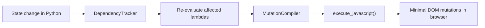

# Reactive Components

Pytonium's reactive component system lets you build UIs entirely in Python.
Define state, render an element tree, and let the framework handle DOM updates
automatically.  When state changes, only the affected DOM nodes are updated --
no virtual DOM diffing, no JavaScript framework running in the browser.

---

## How It Works



1. You define **State** fields on a Component class.
2. In `render()`, you build an element tree using lambdas that reference state.
3. During mount, the framework executes each lambda to discover which state
   fields it reads (dependency tracking).
4. When a state field changes, the framework re-evaluates only the lambdas
   that depend on it, generates a minimal JavaScript string, and sends it
   to the browser in a single IPC call.

---

## Setup & Initialization

Reactive components require a specific initialization order because CEF
registers JavaScript bindings during page load.

```python
from Pytonium import Pytonium
from Pytonium.components import Component

p = Pytonium()
Component.setup(p)                           # 1. Register bindings
p.initialize("file:///path/to/page.html", 800, 600)  # 2. Create browser
my_component = MyComponent()
my_component.mount(p)                        # 3. Render & inject
```

!!! warning "Call setup() before initialize()"
    `Component.setup(p)` **must** be called before `p.initialize()`.  CEF
    binds JavaScript functions during the browser's `OnContextCreated` event.
    Bindings added after the page has loaded are not visible to JavaScript,
    and events will silently fail.

The three steps:

| Step | Method | What it does |
|------|--------|-------------|
| 1 | `Component.setup(p)` | Pre-registers the event router and page-ready sentinel with CEF. |
| 2 | `p.initialize(url, w, h)` | Creates the browser window and loads the HTML page. |
| 3 | `component.mount(p)` | Calls `render()`, injects HTML, analyzes dependencies, registers events. |

---

## Your First Component

Here is a minimal counter component:

```python
from Pytonium.components import Component, State, Div, H1, Button

class Counter(Component):
    count = State(0)

    def increment(self):
        self.count += 1

    def decrement(self):
        self.count -= 1

    def render(self):
        return (
            Div()
                .child(H1().text(lambda: f"Count: {self.count}"))
                .child(Button().text("+").on_click(self.increment))
                .child(Button().text("-").on_click(self.decrement))
        )
```

Key concepts in this example:

- **`State(0)`** declares a reactive field with a default value of `0`.
- **`lambda: f"Count: {self.count}"`** is a reactive binding.  The framework
  tracks that this lambda reads `count`, so it re-evaluates and updates the
  DOM whenever `count` changes.
- **`.on_click(self.increment)`** registers a click event handler.  When
  clicked, `self.count += 1` triggers the dependency graph.
- **`.child()`** appends child elements using a fluent builder API.

---

## Running the Counter

```python
import os
import time
from Pytonium import Pytonium
from Pytonium.components import Component, State, Div, H1, Button

class Counter(Component):
    count = State(0)

    def increment(self):
        self.count += 1

    def decrement(self):
        self.count -= 1

    def render(self):
        return (
            Div()
                .child(H1().text(lambda: f"Count: {self.count}"))
                .child(Button().text("+").on_click(self.increment))
                .child(Button().text("-").on_click(self.decrement))
        )

# Write a minimal HTML page
html = '<html><body><div id="app"></div></body></html>'
html_path = os.path.abspath("_counter.html")
with open(html_path, "w") as f:
    f.write(html)

p = Pytonium()
Component.setup(p)
p.initialize(f"file:///{html_path}", 400, 300)

counter = Counter()
counter.mount(p, container_id="app")

while p.is_running():
    p.update_message_loop()
    time.sleep(0.016)
```

!!! tip "Use file:// URLs"
    Write your HTML (with CSS) to a file and load it via `file:///` URL.
    This avoids size and encoding issues with `data:` URLs for larger pages.

---

## Lifecycle Hooks

Components have three lifecycle hooks you can override:

```python
class MyComponent(Component):
    items = State([])

    def on_mount(self):
        """Called after HTML is injected and events are registered."""
        print("Component is now in the DOM")
        self.items = load_initial_data()

    def on_update(self, changed_fields: set[str]):
        """Called after state changes are applied to the DOM."""
        if "items" in changed_fields:
            print(f"Items updated: {len(self.items)} items")

    def on_unmount(self):
        """Called before the component is removed from the DOM."""
        print("Cleaning up resources")
```

| Hook | When it fires | Use case |
|------|--------------|----------|
| `on_mount()` | After `mount()` completes | Fetch data, start timers, initialize resources |
| `on_update(changed_fields)` | After each state change batch | Side effects, logging, syncing external systems |
| `on_unmount()` | When `unmount()` is called | Cancel timers, close connections, clean up |

---

## Initial State from Constructor

Pass initial state values as keyword arguments:

```python
counter = Counter(count=10)
counter.mount(p)
```

Only keys matching `State` descriptors on the class are accepted.

---

## Mounting into a Container

By default, `mount()` replaces `document.body.innerHTML`.  To mount into a
specific element, pass its HTML `id`:

```python
counter.mount(p, container_id="app")
```

This injects the component's HTML into `<div id="app">`.

---

## Unmounting

Call `unmount()` to remove a component and clean up all its resources:

```python
counter.unmount()
```

This removes event handlers, cleans up the dependency graph, and calls
`on_unmount()`.

---

## Next Steps

- **[Reactive Elements](reactive-elements.md)** -- Learn the element builder
  API for constructing UI trees.
- **[Events & Computed](reactive-interactivity.md)** -- Add event handlers,
  two-way input binding, and computed properties.
- **[Dynamic Lists & Conditions](reactive-lists-conditions.md)** -- Render
  lists from data and conditionally show/hide content.
- **[Components API Reference](../api/components.md)** -- Full reference for
  all classes and methods.
